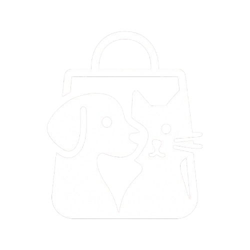

# Solp Pet 🐾

**Solp Pet** é um sistema de gerenciamento de animais, desenvolvido especialmente para Pet Shops.  



<br>

## 🚀 Rodando localmente

Para rodar o projeto localmente, siga os passos abaixo:

Clone o repositório:
```bash
git clone https://link-para-o-projeto
```

Entre no diretório do projeto:
```bash
cd solp-pet
```

Instale as dependências:
```bash
npm install
```

Inicie o servidor:
```bash
npm run start
```

<br>

## 🔧 Melhorias Futuras

Algumas melhorias que podem ser implementadas:
- Refatoração de componentes
- Melhorias de performance
- Acessibilidade aprimorada
- Adição de testes automatizados

<br>

## 🛠️ Stack utilizada

**Front-end:** Next.js, TailwindCSS  
**Back-end:** Node.js, NestJS